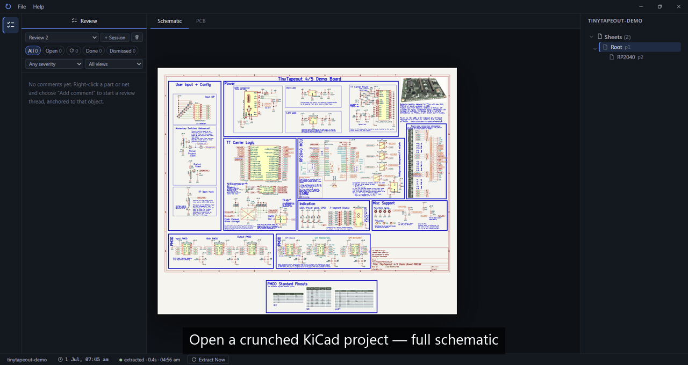

# SpinZero

Review KiCad PCB designs - pin comments to the actual nets, footprints, and traces, and let SpinZero track what changed between revisions. No cloud, no account, no upload.



## Get started

1. **Install** — grab the signed Windows installer from the
   [Releases page](https://github.com/spinzero-pcb/spinzero/releases).

2. **Open your project** — point SpinZero at your KiCad project folder. It
   imports the schematic and board as-is; your KiCad files are never
   modified.
3. **Start reviewing** — everything below happens inside SpinZero while you
   keep editing in KiCad as usual.

## How you use it

### Find anything fast

Press **Ctrl+F** and type a net or component name — SpinZero searches the
whole design and jumps you to it. **Ctrl+P** opens the command palette for
everything else (e.g. the measure tool is **Ctrl+Shift+M**).

### Jump between schematic and board

Select a net or component and press **X** to cross-probe: the same object
lights up on the schematic and the copper, so you can check a routing
concern against the schematic intent in one keystroke.

### Pin comments where they belong

Right-click a net, footprint, or trace and add a comment — it stays anchored
to that object. Threads live in the
review panel, so discussion and design stay side by side.

### Keep reviewing as the design changes

Every time you save in KiCad, SpinZero snapshots the design automatically.
When something a comment points at moves or changes, that comment is flagged
for re-check - you will never sign off against a stale markup. The **Changes**
panel lists exactly what differs between revisions and tracks your review
progress through it, and the history graph lets you step back through any
earlier snapshot.

### Check the BOM

The **BOM** tab gives you the bill of materials extracted straight from the
design, ready to sanity-check parts during review.

## Your files stay yours

SpinZero reads KiCad file formats with its own parser — it never links,
embeds, or invokes KiCad code, and it never writes to your source files.
Your originals are stored untouched as the system of record; everything
SpinZero derives from them is regenerable. Nothing leaves your machine, and
crash/usage reporting is opt-in (File ▸ Privacy).

## Building from source

Prerequisites: [Node.js](https://nodejs.org) (LTS), [Rust](https://rustup.rs)
(≥ 1.95), and on Windows the MSVC build tools (installed by the Rust setup).

```sh
npm install
npm run tauri dev     # hot-reloading dev build
npm run tauri build   # release build → src-tauri/target/release/spinzero.exe
```

Frontend-only checks: `npm run build` (tsc + vite) and `npx vitest run`.
Rust tests: `cargo test --lib` in `src-tauri/`.

A build from source has telemetry disabled by default: crash/usage reporting
is compiled in only when a Sentry DSN is provided at build time (see
[`.env.example`](.env.example)). Updater signing also lives in `.env` —
without it you get a normal unsigned dev build.

## License

SpinZero is free software, licensed under the
[GNU General Public License v3.0 or later](LICENSE) — the same license family
as KiCad. Individual use is free forever; team sync licenses fund development.

## Contributing

Issues and pull requests are welcome — see
[CONTRIBUTING.md](CONTRIBUTING.md), which also describes the project layout.
Bug reports with a minimal KiCad project that reproduces the problem are
especially valuable.
